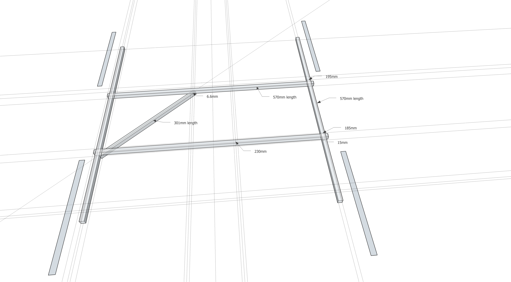

# FunCub QuadPlane (Pixhawk)

A QuadPlane is one of our VTOL types which essentially is a normal
plane combined with a standard quad airframe. 

## Airframe

The actual plane looks roughly like as shown in the image above (other similar models will work
just fine - this is a Multiplex Fun Cub). The minimal equipment required is:

-   Pixhawk or compatible
-   Digital airspeed sensor
-   900 kV motors, 10" (10x45 or 10x47) propellers
-   GPS module
-   4S battery

## Structure

The structure is made out of aluminum booms as shown below.

## Wiring

The outputs of Pixhawk should be wired like this (orientation as seen
like "sitting in the plane").

> **Success** The servo direction can be reversed using the
  PWM\_REV parameters in the PWM_OUTPUT group of QGroundControl (cogwheel
  tab, last item in the left menu)

-   MAIN1: Front right motor, CCW
-   MAIN2: Back left motor, CCW
-   MAIN3: Front left motor, CW
-   MAIN4: Back right motor, CW
-   AUX1: Left aileron TODO
-   AUX2: Right aileron
-   AUX3: Elevator
-   AUX4: Rudder
-   AUX5: Throttle

For further instructions on wiring and configurations please see: 
[Standard VTOL Wiring and Configuration](../config/standard_configuration_vtol_quad.md).

## Airframe Configuration

Configure the frame as shown in QGroundControl below 
(do not forget to click **Apply and Restart** in the top).

## Support

If you have any questions regarding your VTOL conversion or
configuration please visit <http://discuss.px4.io/c/vtol>.

