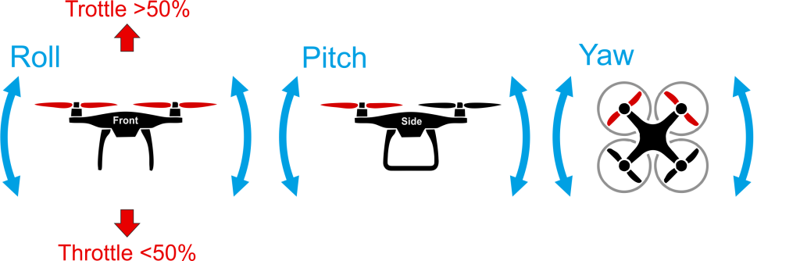
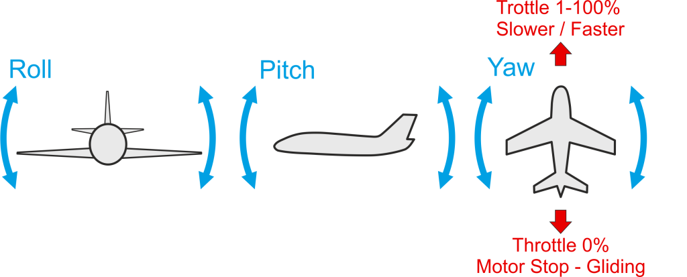

# What is a UAV

In this chapter we will introduce you to the most basic concepts of setting up and controlling your drone. This section is meant mostly for novice users but it is a good quick start introduction to PX4 autopilot concepts for the experienced users as well.

## What is an amateur UAV?

An Unmanned Aerial Vehicle (UAV) is an aircraft that has the capability of autonomous flight, without a pilot in control. Amateur UAVs are non-military and non-commercial. They typically fly under “recreational” exceptions to FAA regulations on UAVs, so long as the pilots/programmers keep them within tight limits on altitude and distance. Usually the UAV is controlled manually by Radio Control (RC) at take-off and landing, and switched into GPS-guided autonomous mode only at a safe altitude. (Confused by all the acronyms and unfamiliar terms in UAVs? A glossary is here.)

## What do I need to make one?
---1) An RC plane, muticopter (quadcopter/hexacopter/tricopter, etc) or helicopter. You can buy them ready to fly, including autopilot, here. If you want to build your own, these instructions are a good starting point.
---2) An autopilot, such as Pixhawk (see below)
---3) Optional: a useful “payload”, such as a digital camera or video transmission equipment

## What does DIY Drones have to offer?
The DIY Drones community has created the world's first "universal autopilots", ArduPilot Mega (APM) and its next-generation big brother, Pixhawk. They combines sophisticated IMU-based autopilot electronics with free autopilot software that can turn any RC vehicle into a fully-autonomous UAV.

A full setup consists of:
Pixhawk autopilot: The electronics, including twin processors, gyros, accelerometers, pressure sensors, GPS and more (shown at right). Available from 3D Robotics.
Mission Planner software:  Desktop software that lets you manage APM and plan missions, along with being a powerful ground station during flights and helping you analyze mission logs afterwards.
Autopilot software (automatically loaded by the Planners):
Arduplane: for any fixed-wing aircraft
Arducopter: for any rotary-wing aircraft
ArduRover: for any ground- or water-based vehicle 
You can buy Ready-to-Fly UAVs (both planes and multicopters) from 3D Robotics:

## Flight Safety
 
Last but not least is flight safety. The RCAPA guidelines are an excellent set of checklists and do's and don'ts, so please refer to them.
Also, here's the FAA's official word on what's legal and what's not.

-------------------------

## PX4 Autopilot

PX4 is platform independent autopilot software (or a software stack/firmware) that can fly or drive Unmanned Aerial or Ground Vehicles (UAV/UGV). It is loaded (flashed) on certain [vehicle control hardware](flight_controller_selection.md) and together with Ground Control Station it makes a fully autonomous autopilot system. 

The PX4 ground control station is called  [QGroundControl](http://qgroundcontrol.com/) and is integral part of the PX4 Autopilot System. [QGroundControl](http://qgroundcontrol.com/) can run on [Windows, OS X or Linux](http://qgroundcontrol.com/downloads/). With the help of  QGroundControl you can load (flash) the PX4 on to the  [vehicle control hardware](flight_controller_selection.md), you can setup the vehicle, change different parameters, get real-time flight information and create and execute fully autonomous missions.

## Heading and Directions

All the vehicles, boats and aircraft have a heading direction or an orientation based on their forward motion.

It is important to know the vehicle heading direction in order to align the autopilot with the vehicle vector of movement. Despite it is not obvious, Multicopters have a heading despite they are symmetrical from all sides. Usually manufacturers use a colored props or colored arms to indicate the heading.

In our illustrations we will use red coloring for the front propellers of multicopter to show heading.

You can read in depth about heading in [Flight Controller Orientation](../config/flight_controller_orientation.md)

## PX4 Connections

In order to set up, control and interact with your PX4 drone you need to connect with it. There are tree main types of connection you can have to Pixhawk hardware and respectively to PX4:

* [Remote Control \(RC\) Connection](TBD) - Connection between the RC handset and vehicle-based receiver that you use to manually direct the vehicle.
* [Data/Telemetry Connection](TBD) - Connection between QGroundControl and your drone by Data Radio, Wifi or USB cable.
* Off-board Connection - A data connection between PX4 and external microcomputer that can control PX4.

You can follow the links to see detailed explanation on each connection type.

## Remote Control

The most basic form of control you can have over your drone is performed with a Remote Control. There are different types of RCs but we will give an example with the most popular form of RC for aircraft.

The difference between Mode1 and Mode2 Remote Control is only the placement of the throttle for right and left handed people. You have to try and decide which one is for you before you buy one.

## Basic Flying

In order to control your aircraft you have to know and understand what the basic Roll, Pitch, Yaw and Throttle commands are and movement of the craft they produce in the 3D space.

There is a difference in the reaction of your aircraft to the above basic commands depending if it is Hover Aircraft - Helicopter, Multicopter or Forward flying aircraft - Plane

* **Hover aircraft** basic movements - Helicopter, Multicopter or VTOL in vertical flight.

You have to remember that for hover aircraft (multicopters, helicopters) Pitch command will produce forward/backward movement. Roll command will produce left/right movement and yaw command will produce left/right rotation against the center of the frame.

* **Forward flying** aircraft basic movements - Airplanes, VTOL in forward flight.

You have to remember that for forward flying aircraft (airplanes) Pitch command will produce up/down movement. Roll command will produce left/right rotation and a turn movement and yaw command will produce left/right tail rotation and turn. The best turn for airplanes can be performed with Roll and little Yaw command at the same time. This is called coordinated turn but you have to gain experience to try it.

With this 4 basic commands you can move around your aircraft in all directions in the air. Most importantly you will be able to perform the most important maneuver for aircraft - take off and landing.