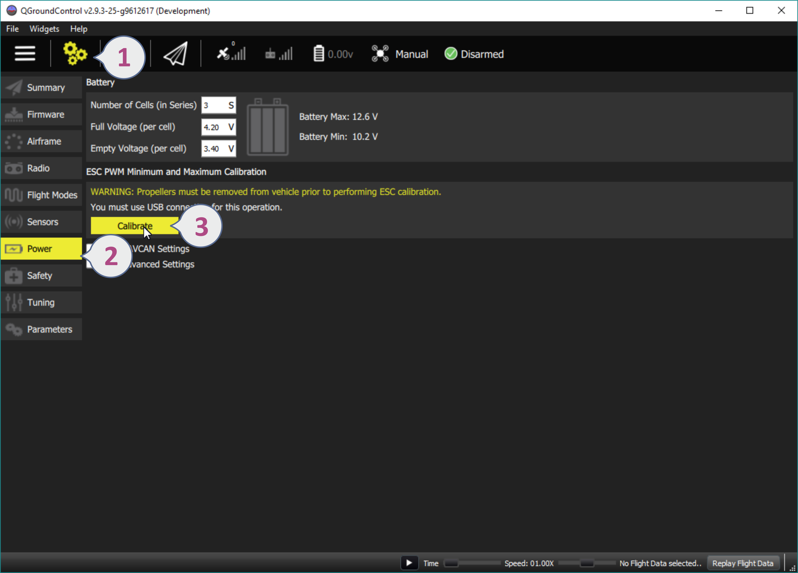
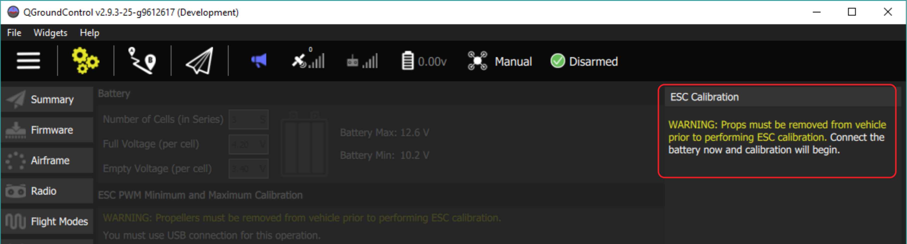

# ESC 칼리브레이션

ESC(Electronic speed controllers)는 RC나 flight controller로부터 받은 입력을 모터로 전달합니다. ESC는 매번 칼리브레이션을 수행할 필요는 없습니다. 고급 컨트롤러는 팩토리 칼리브레이션이 되어 있어서 PWM\_MIN와 PWM\_MAX 파라미터를 설정만 해주면 됩니다. 멀티콥터에 있는 모든 ESC는 동일한 방식으로 FC로부터 받은 입력을 모터로 스케일링을 수행합니다. 그러나 다양한 저렴한 모델은 칼리브레이션이 필요하므로 만약 확실하지 않으면 칼리브레이션을 수행하는 것을 추천합니다. 수행하는 방법은 다음과 같습니다. :

> **경고** 프로펠러를 장착한 상태로는 절대로 ESC 칼리브레이션을 수행하지 않습니다. 시작하기 전에 프로펠러를 분리하세요.

칼리브레이션 단계를 시작할 때, 첫단계로 USB만 FC에 연결합니다.

다음으로 배터리를 연결하라는 지시가 나옵니다.

칼리브레이션이 자동으로 시작됩니다.

완료될때까지 기다립니다.

이제 ESC 칼리브레이션이 완료되었습니다.
